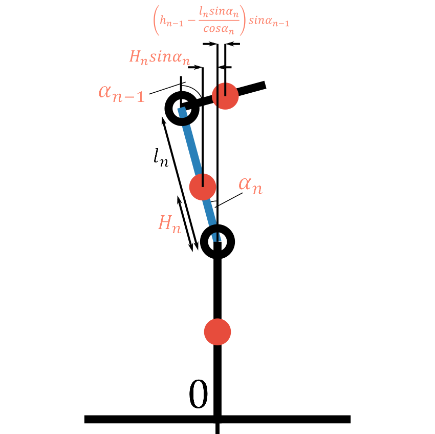
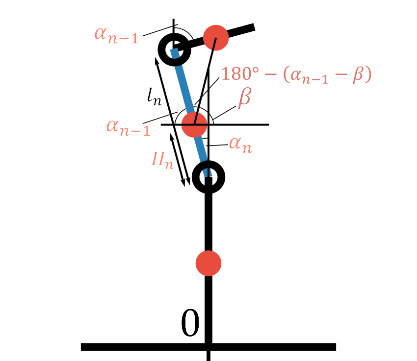

## はじめに

ご覧いただきありがとうございます。ここではMonoMotionで、3Dモデル作成補助システムとしてご説明したReficereが、実際に内部で何をやっているのかについてご説明していきます。

この記事のターゲットは数式に威圧されたい方々や物理オタクの方々を考えており、ある程度丁寧には書きましたが重要ではない細かい説明(途中式等)は省いています。

また、図の説明などは誤解のないよう丁寧に書いていることもありますので、冗長に感じたのであれば読み飛ばしてください。

## 概要

Reficereは、ロボットの各リンク(関節に挟まれた部分: 太もも等)の重量測定と重心位置の計算を支援するシステムです。

これまで、ロボットの3Dモデル(URDFを想定)を作成するには、ロボットの各リンクの大きさを測り、分解して重量測定をしたりする必要がありました。特に重量測定では分解は面倒な上に、単純な方法でリンク内の重心位置を求めることはできませんでした。

Reficereではその問題を大幅に改善し、あるリンクより上に位置するリンク全ての重量がわかれば、そのリンクの重量とリンク内での重心位置が、放って置くだけで、短時間に、実用に耐えうる精度をもって計測できます。これはつまり、ロボットの最上位リンクの重量がわかれば全てのリンクの重量が漸化式のように芋づる式に計測可能ということです(もちろんそうでない場合もあります)。

これを実現するため、Reficereでは重心センサ兼重量センサ(重心センサ)を製作し、使用しました。詳しい説明は別途しますが、ロードセルと呼ばれる重量センサを4つ使ったものです。

図1は今回の計測で重要になる値を無理やり押し込んだ図です。かなり煩雑なので、雰囲気だけ味わっていただければと思います。最終目標は図1でのw_n(求めるリンク(ターゲットリンク)の重さ)とH_n(ターゲットリンク内での重心位置)を求めることですが、未知数の多さにより単純な測定では求められないので、3回の計測によって必要な数値を(少しテクニカルな方法で)求めていきます。具体的な立式や途中計算は煩雑なため省きますが、立式のコンセプトや実装上の注意等は省略せず以下に詳しく書いていきます。

図1:

## 測定器具

### 器具

測定器具は単純で、ロボット本体と重心センサ(写真1-2)です。

写真1: 重心センサ 裏(地面側)から

写真2: 重心センサ ロードセルをメインに

重心センサには500gのロードセル(金属棒中央のゆがみによって重さを精密に量るセンサ)4つを使いました。CNCでMDFボードを少し削り、ひずみを持てる余裕を作ったん落ちにネジで固定しています。地面につく側はネジをナットで浮かせて作りました。このあたりの設計は適当極まりないので、参考程度です。

なお、紙の下に使っていないロードセルがありますが、これはこのロードセルがもともとはロボットの足裏に設置するもので、8つまとめて配線してあったものを再利用し4つだけ使用しているからです。

ロードセルの詳しい使い方はここでは省略します。

### 重心測定の実装

これから説明していく測定ではよく重心の位置を利用していきます。そのため、重心位置は高い精度をもって図らなければならなくて、それに少し実装上の工夫をしましたので軽く説明します。

測定した重心の生データは重心センサの上に載っているロボットの重さと重心だけでなく、重心センサそのものの重さと重心位置をも反映した値となっているはずです。このデータでは、ロボットについて精密な測定はできません。

そこで今回では、Reficere起動時には重心センサは空中に上げた状態とし、その状態でロードセルのオフセットをとり、その後に重心センサのみを地面の上に置き、重心センサ自体の重さと重心位置の測定を行うことでこの問題を計算で補正することに成功しました。余談ですが、重心センサにはセンサからのケーブルがあり、そのケーブルを触るだけでも重心位置は変化するため、測定中はケーブルを地面に固定するなどの対策を取りました。

また、ロードセルについて、HX711というADコンバータを挟んで使ったのですが、サンプリングレートを上げたところ少しノイズが入ったり、時々変な値が出たりしたので、何回か計測し、最大最小10%ほどを除いた平均を使うことで対応しました。複数回の計測をしたことで、サンプリングレートを上げはしたものの、当初思ったほどには計測スピードは向上しませんでした。

## 測定・計算式

### 測定1: h_n-1 を求める

#### 立式

測定1ではh_n-1(上位リンク全ての共通重心の高さ)を求めます。ここではターゲットリンクを図2の青色のリンクとし、赤丸はリンク内の重心位置と重量、黒丸はジョイント、黒棒はリンクを表します。赤字は未知の数量、黒字は既知の数量です。

図2: h_n-1の測定図

図2のように、上位リンクを角度θだけ曲げたときの足裏での重心位置の変化量をx_1とすると、重心周りのモーメント和から、以下の式1が与えられます。ただし、x_1は重心位置の変化量、Wはロボット全体の重量です。

式1: h_n-1を求める計算式

今回では上位リンクの重量は与えることになっているので、この測定によりh_n-1は全て既知の値で表すことができます。

なお、h_nについて、H_nとw_nが求まっている状態であれば、測定なしに以下の式で求められる場合もあります。

式1.1: h_nの別の計算式

#### 実装

立式では特に単位は考えていませんが、実装では単位に気をつけることが必須です。今回ではReficere全体を通して、重量は[g]、長さは[mm]に統一しています(重心位置の変化量も単位は[mm]です)。また、角度の単位が度なのかラジアンなのかも重要です。今回では人間が認知するところでは度を使いましたが、内部では関数の実装の関係上ラジアンで書いています。

測定誤差についてですが、思考実験でも理解できると思いますが、θが0に近づけば近づくほどh_n-1の測定誤差は大きくなります。今回では計測回数を16回にし、使用するθは90度から75度程度にしました。それに加え、16個のデータの最大最小それぞれ3個ずつを除外した中央10個のデータの平均値を出力しました。このあたりの実装は適当です。

### 測定2: α_n、α_n-1を計測する

#### 立式

測定2では、ターゲットリンクと上位リンク(のジョイント(面倒なので以下省略))をそれぞれ曲げたときに、重心位置が変化しない状態を探し、その時の図3の示す角度α_n、α_n-1を計測します。

図3:

今回では簡単のため(且つこの制限によってReficereを使用可能な場合が限られることはそれほど多くないだろうという推測もあり)、α_n + α_n-1 = 90°としましたが、理論上ではこの角度は何度でも、少し計算式をいじることで対応可能だと思います。

詳しくは実装の項目で書きますが、ロボット自体の制御は非常に単純明快です。

ここでの立式は、重心位置が変化しないことに留意して、上位リンクの重量と腕の長さ、ターゲットリンクの重量(未知)と腕の長さを利用してモーメントの関係式(式2)を作ることです。この式とこの測定だけでは何もわかりませんが、あとで使用します。

式2: 重心位置不動の状態を示す式

#### 実装

実装はいたって単純です。α_n + α_n-1 = 90度を満たしながら、重心位置を計測し、目標値(0)との差からPID制御などで可能です。今回ではP制御でも発振しなかったので(実装の時間の関係もあり)P制御だけで制御しています。

また、実は今回の実装はあまりよろしくなく、上部リンクをα_n + α_n-1曲げた後にターゲットリンクを曲げていく手法をとりました。これでは上部リンクが重かったりh_n-1が大きい(上部リンクの重心位置が高い)時にはロボットが倒れてしまう可能性があります。もっとうまい制御方法はあると思います(例えば、α_n + α_n-1を徐々に大きくしていきながら重心位置0を保つ制御)。

### 測定3: βを計測する

#### 立式

測定3は全測定で一番理論が複雑なところですので、いくつか細かな項目に分けて少し丁寧に説明していきます。

全体像は図4、5です。

図4: βの示す角度

図5: 測定3の全体像

測定3での一番重要な点は、図5で、ターゲットリンクの重心位置と上位リンクの重心位置を結んだ線(重心線)が地面と垂直になる点です。これによって足裏での重心位置の変化量を計算する際のモーメントでの腕の長さが2通りで表すことができます。

段階を追って詳しく内容を説明していきます。

##### H_nをβを用いて表す

H_nは今の所最終的に導きたい未知数ですので、これをここで決定する未知数であるβを使って表すと後々便利に使えます。測定2の状態に補助線を足した図6から、式3が導ます。

図6: 必要な角と長さ

式3: 図6から導ける式

なお、式3ではtan内から180度という数値は相互関係を使って外しています。

##### γの計算

図5でのγをβを使って表していきます。この際、図7で示すmの値に着目します。

図7: 長さmの定義

図7より、式4が導け、式4と式3(H_nをβで表す便利な式)から、最終的に導きたい形で式5が導けます。

式4: mを2通りで表す

式5: γとβの関係式

##### 重心線が地面と垂直になる状態の関係式

βが正しい値のときに式5によって算出されるγを使用すると、ターゲットリンクの重心位置と上位リンクの重心位置を結んだ線が地面と垂直になります。ここでは垂直という条件を表す関係式を導きます。具体的な方針としては、図5の状態でw_nを表す式を2つ作り連立してw_nを消すだけですが、それぞれの式が非常に重いです。

w_nを表す1つ目の式では、式3(H_nをβで表す便利な式)と、三角関数の加法定理を用いた式の連立をしたものです。順を追って説明していきます。注目する三角形は測定2の状態の、図8の緑色の三角形です(測定3の状態ではありません)。長さsとtは新たに定義しました。この長さは後で消去できるのでこのまま放っておきます。

図8: sin(α_n+β)への参考

_これについて、sin(α_n+β)を2通りで表します。緑色の三角形について素直に三角比の定義から相互関係を使って表すと式6になります。

式6: sin(α_n+β)表し方1

また、加法定理でsin(α_n+β)を分解して、図から導ける式7を代入すると、式8ができます。

式7: βの三角関数

式8: sin(α_n+β)表し方2

式3(H_nをβで表す便利な式)と式6と式8を連立してH_nとβ(とsとt)を消去すると式9になります。

式9: w_nの表し方1

少し整理をすると、測定3の状態を表す式を作るために、2つのw_nを表す式を使うことにしたうちの1つが式9で出てきたところです。

次は、w_nを表す2つ目の式です。次は重心位置の測定結果を使った表し方で、式9よりは単純です。

測定3の状態では、ターゲットリンクと上位リンク、それぞれの重心位置を結んだ線は地面と垂直になります。これに注意して立式すると、式10ができます。x_3は重心位置の変化量、Wはロボット全体の重量です。

式10: w_nの表し方2の元の式

これを式3(H_nをβで表す便利な式)でH_nを消して整えると式11ができます。

式11: w_nの表し方2

式9と式11より、w_nを消去して、測定3の状態を表す式12ができます。

式12: 測定3の状態式

#### 実装

測定3の実装もまた複雑です。グラフ1で最も大切なのが青のグラフ(式12の右辺と左辺の差)です。簡単に説明すると、グラフ1で青のグラフが(β=90度以外で)0を示す場合を探すことで求められます。

グラフ1: 理論値(事前に分解して測定した値を含む)に基づいた測定3のグラフ

グラフ1で緑(γ)は、横軸βによって式5から算出したγ[度]、赤(x_3)はw_nを実測した値から導いた、図6の状態でのロボット全体の重心位置[mm]で、計測には関係ありますが実装には関係ない値です。

要するに、βが正しい値の時にのみ式12が成立するので、式12の両辺の差分が0になるようにβを動かして調整すれば良いということです。この制御も本来はPID制御等でやるべきですが今回はP制御でうまくいきました。

余談ですが、今回の実装では差分の閾値(0にこれだけ近かったら計測完了とする値)と、差分の変化量(PID制御ではD、微分した値)の閾値のそれぞれを使用して、正しいβがいくらかを制御の中で判断しています。

### 目的の値の計算

ここまでの3回の測定で、求めるべき未知の値は求まりました。これらを使えばすぐに目的の値(w_nとH_n)が計算できます。この計算方法はいろいろあると思いますが、今回では以下の2式を使いました。

式9: w_nの計算式

式3: H_nの計算式

## 最後に

ここまで読んでくださりありがとうございます。自分でも思った以上のボリュームになってしまいました。要するに普通は計測できない値をどうにかこうにか計測してやろうという魂胆なわけで、難しめ(？)の物理の問題(それもシステムを作っている段階では解けるかわからない問題)を解いているようなものでした。このシステムの鍵は、重心位置を計測できることを利用してどう立式するかだと思いました。また、実装では単位系やロボットの制御、様々な問題が絡み合ってくる、あまり本質でないところで躓いてしまい、思った以上に手間取ってしまいました。ここは反省です。

Reficereの式はかなり複雑なのと時間がなかったのとで、数学的な検証が十分ではありません。desmosでグラフを描いて確認はしたつもりですが、もし興味のある方でなにか間違いを発見した方がいらっしゃいましたらご連絡ください。

ありがとうございました。
